# Everything Markdown

Turn web pages, AI chats, and browser-plugin conversations into Markdown.

Everything to Markdown, locally.

[Download the app](https://github.com/bai323/wanwu-markdown/releases/latest) · [Chinese README](README.zh-CN.md) · [Beginner guide](docs/getting-started.en.md) · [Real examples](docs/examples.en.md)


Everything Markdown is a local-first workbench. It does not try to become your new knowledge base. It does one small job: take content you are allowed to keep and turn it into readable, traceable files.

## Why This Exists

AI work is becoming branchy, tool-heavy, and hard to revisit. A useful answer is no longer just a block of text. It has source pages, model replies, alternate branches, intermediate reasoning, files, labels, and a path back to the original context.

Everything Markdown turns that mess into a durable local asset.

## Core Ideas

Personal digital assets: save pages and conversations into your own archive instead of leaving them trapped in a browser tab or plugin panel.

agent-readable format: Markdown is the human layer; JSON and JSONL keep the same material useful for agents, labeling, evals, and later automation.

visual capture reports: long conversations should be visible. Branch reports show forks, model sources, and alternate answer paths in a way you can compare.

## Real Cases

These public cases use a real captured Sider conversation as the source of structure and metrics. The visual examples only show selected, presentation-safe slices instead of uploading the full private conversation.





## What It Can Capture

- Web pages, including normal articles, WeChat articles, and X posts.
- AI chats from Claude, ChatGPT, Gemini, Codex, and similar web tools.
- Browser-plugin conversations, currently focused on Sider.
- Existing JSON or conversation graph files.

## Outputs

- Markdown for reading, notes, and Obsidian.
- HTML branch reports for visual review.
- Structured JSON for source-preserving automation.
- JSONL drafts for labeling, evals, and dataset preparation.
- Optional Obsidian vault export.

## First run

Install Node.js 22 or newer.

```bash
npm install
npm start
```

Then open:

```text
http://localhost:4173
```

On macOS, you can also double-click `Start-Everything-Markdown.command`.

## Inputs

Web pages: copy the URL from the browser address bar and paste it into the web-page input.

AI chats: open the target conversation and copy the current page URL. Some AI products do not expose complete chats through public pages. If capture fails because of auth, blank screens, or dynamic loading, use official export, manual copy, or structured file import.

Browser plugin: Sider does not need a URL. Open the target Sider chat in Chrome, then click `Detect current chat`.

Import file: treat JSON as a recoverable archive file. It is useful for past captures, structured conversations, and developer exports.

## Release boundary

Everything Markdown should only process content you are allowed to access and keep. Respect site terms, export rules, copyright, and privacy.

This `0.1.0` release is for personal archiving and small-scale research. Do not treat raw output as a production training dataset without deduplication, consent records, privacy review, quality checks, and human sampling.

## Development

```bash
npm test
npm run build
npm run lint
```

## Privacy

The default design is local-first: captures, Markdown, reports, structured data, and Obsidian outputs stay on your machine. See [PRIVACY.md](./PRIVACY.md).

## License

Free and open source under the MIT License. See [LICENSE](./LICENSE).
