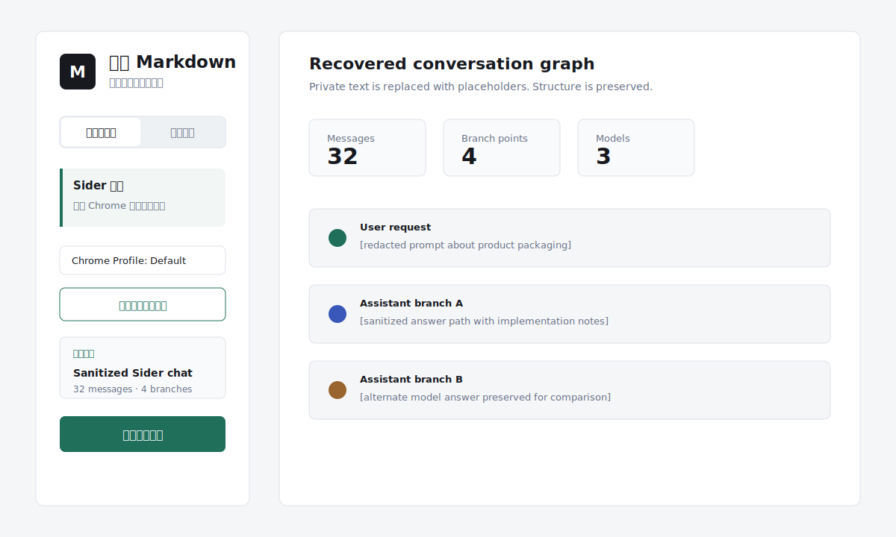
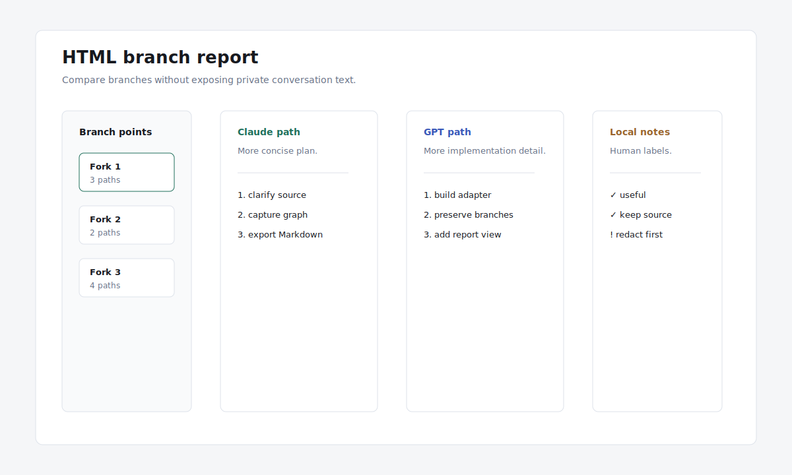
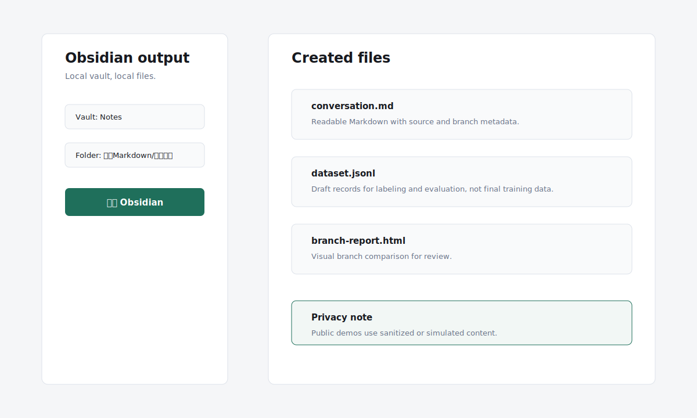

# 万物 Markdown / Everything Markdown

把网页、AI 对话和浏览器插件里的内容整理成 Markdown。

Turn web pages, AI chats, and browser-plugin conversations into Markdown.


万物 Markdown 是一个本地工作台。它不试图变成新的知识库，也不替你决定内容该怎么用。它只做一件事：把你有权保存的网页、对话和资料，整理成清楚、可追溯、方便继续处理的文件。

Everything Markdown is a local-first workbench. It does not try to become your new knowledge base. It does one small job: take content you are allowed to keep and turn it into readable, traceable files.

Everything to Markdown, locally.

## Start here

- 中文：[新手教程](docs/getting-started.zh-CN.md) / [真实使用示例](docs/examples.zh-CN.md)
- English: [Beginner guide](docs/getting-started.en.md) / [Real examples](docs/examples.en.md)

## Real cases / 真实案例

These public cases use sanitized or simulated content. The workflows are real; private Sider chat text is not uploaded.

这些公开案例使用脱敏或模拟内容。流程是真实的，但不会把私人 Sider 对话原文上传到公开仓库。







## 中文

### 适合做什么

- 保存微信公众号文章、X 帖文和普通网页。
- 整理 Claude、ChatGPT、Gemini、Codex 等 AI 对话页面。
- 读取浏览器插件中的会话，目前重点支持 Sider。
- 把长对话整理成 Markdown、HTML 分支报告、结构数据和训练数据草稿。
- 一键写入本机 Obsidian Vault。

### 第一次运行

先确认已经安装 Node.js 22 或更高版本。

```bash
npm install
npm start
```

启动后打开：

```text
http://localhost:4173
```

macOS 用户也可以双击 `启动万物Markdown.command`。它会安装依赖、同步本地应用目录并打开工作台。

### 常见入口

网页文章：复制浏览器地址栏里的链接，粘贴到“网页文章”入口。

AI 对话：打开目标对话页，复制当前页面 URL。很多 AI 产品的对话并不总是公开可抓取，遇到权限页、空白页或动态加载失败时，可以改用官方导出、复制内容或结构化文件导入。

浏览器插件：Sider 插件不用填写 URL。先在 Chrome 的 Sider 中打开目标对话，再回到工作台点击“重新检测当前对话”。

导入文件：不用先理解 JSON。可以把 JSON 理解成“可恢复的存档文件”，适合导入历史采集结果、别人给你的结构化对话，或开发者导出的 conversation graph。

### 输出内容

- Markdown：适合直接阅读、整理和放进笔记库。
- 分支报告：用于查看长对话中的分支、模型来源和不同回复路径。
- 结构数据：保留消息、来源、分支关系和基础元数据。
- 训练数据：生成 JSONL 草稿，方便后续筛选、清洗和标注。
- Obsidian：把 Markdown、报告和数据文件写入指定 Vault。

### 发布边界

万物 Markdown 只应该处理你有权访问和保存的内容。请尊重网站条款、平台导出规则、版权和他人隐私。

当前版本更适合个人资料整理和小规模研究，不建议直接把原始输出当作可商用训练集。用于训练或标注前，建议增加去重、脱敏、质量审核、授权记录和人工抽检流程。

## English

### What it is for

- Save WeChat articles, X posts, and regular web pages.
- Organize AI chats from Claude, ChatGPT, Gemini, Codex, and similar tools.
- Recover browser-plugin conversations, currently focused on Sider.
- Export long chats as Markdown, HTML branch reports, structured data, and JSONL dataset drafts.
- Write outputs directly into a local Obsidian vault.

### First run

Install Node.js 22 or newer.

```bash
npm install
npm start
```

Then open:

```text
http://localhost:4173
```

On macOS, you can also double-click `启动万物Markdown.command`. It installs dependencies, syncs the local app directory, and opens the workbench.

### Inputs

Web pages: copy the URL from the browser address bar and paste it into the web-page input.

AI chats: open the target conversation and copy the current page URL. Some AI products do not expose complete chats through public pages. If capture fails because of auth, blank screens, or dynamic loading, use official export, manual copy, or structured file import.

Browser plugin: Sider does not need a URL. Open the target Sider chat in Chrome, then click “Detect current chat”.

Import file: you do not need to understand JSON first. Treat it as a recoverable archive file for past captures, structured conversations, or developer exports.

### Outputs

- Markdown: readable notes for personal archives.
- Branch report: a visual HTML report for long conversations with branches and model sources.
- Structured data: messages, source metadata, and branch relations.
- Training data: JSONL drafts for later filtering, cleaning, and labeling.
- Obsidian: Markdown, reports, and data files written into a selected vault.

### Release boundary

Everything Markdown should only process content you are allowed to access and keep. Respect site terms, export rules, copyright, and privacy.

This `0.1.0` release is for personal archiving and small-scale research. Do not treat raw output as a production training dataset without deduplication, consent records, privacy review, quality checks, and human sampling.

## Development

```bash
npm test
npm run build
npm run lint
```

## Privacy

The default design is local-first: captures, Markdown, reports, structured data, and Obsidian outputs stay on your machine. See [PRIVACY.md](./PRIVACY.md).

## License

Free and open source under the MIT License. See [LICENSE](./LICENSE).
