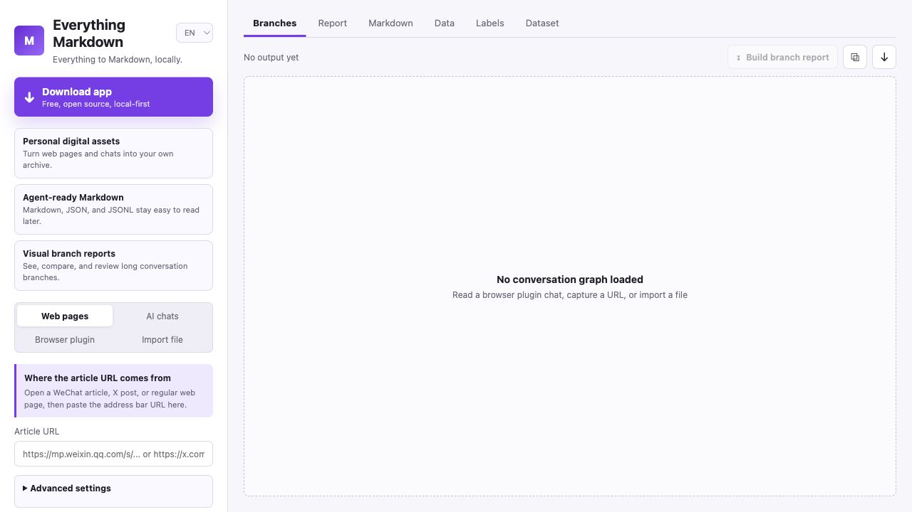

# 万物 Markdown

把网页、AI 对话和浏览器插件里的内容整理成 Markdown。

一键整理你有权保存的网页、对话和资料。

[下载 App](https://github.com/bai323/wanwu-markdown/releases/latest) · [英文 README](README.md) · [新手教程](docs/getting-started.zh-CN.md) · [真实使用示例](docs/examples.zh-CN.md)



万物 Markdown 是一个本地优先的工作台。它不试图替代你的知识库，也不替你决定内容该怎么使用。它只做一件事：把你有权保存的网页、对话和资料，整理成清楚、可追溯、方便继续处理的文件。

## 为什么做

AI 工作正在变得越来越分叉、越来越依赖工具，也越来越难复盘。一个有价值的回答不再只是几段文字，它还包含来源页面、模型回复、替代分支、中间过程、文件、标签，以及回到原始上下文的路径。

万物 Markdown 想把这些东西沉淀成真正属于你的本地资产。

## 核心特点

沉淀属于自己的数字资产：把网页、AI 对话、插件会话保存到自己的资料库，而不是留在浏览器标签页或插件面板里。

Agent 优先读取格式：Markdown 是人读的层，JSON 和 JSONL 让同一份材料也能继续给 agent、标注、评测和自动化流程读取。

视觉友好的采集报告：长对话不应该只是一条线。分支报告会把分叉点、模型来源、替代回答路径展示出来，方便比较和复盘。

## 真实案例

这些公开案例使用你真实采集过的 Sider 长对话作为结构和指标来源。为了适合公开展示，案例只选择视觉上最能说明问题的局部，不上传完整私人对话原文。





## 可以采集什么

- 网页文章，包括普通文章、微信公众号文章和 X 帖文。
- Claude、ChatGPT、Gemini、Codex 等 AI 对话页面。
- 浏览器插件会话，目前重点支持 Sider。
- 已有 JSON 或 conversation graph 文件。

## 输出什么

- Markdown：适合阅读、笔记和 Obsidian。
- HTML 分支报告：适合视觉复盘。
- 结构化 JSON：保留来源和分支关系，方便继续自动化。
- JSONL 草稿：用于后续标注、评测和数据集准备。
- Obsidian Vault 输出：把结果写入自己的笔记库。

## 第一次运行

先确认已经安装 Node.js 22 或更高版本。

```bash
npm install
npm start
```

启动后打开：

```text
http://localhost:4173
```

macOS 用户也可以双击 `启动万物Markdown.command`。

## 常见入口

网页文章：复制浏览器地址栏里的链接，粘贴到“网页文章”入口。

AI 对话：打开目标对话页，复制当前页面 URL。很多 AI 产品的对话并不总是公开可抓取，遇到权限页、空白页或动态加载失败时，可以改用官方导出、复制内容或结构化文件导入。

浏览器插件：Sider 插件不用填写 URL。先在 Chrome 的 Sider 中打开目标对话，再回到工作台点击“重新检测当前对话”。

导入文件：不用先理解 JSON，可以把它理解成“可恢复的存档文件”。适合导入历史采集结果、别人给你的结构化对话，或开发者导出的 conversation graph。

## 发布边界

万物 Markdown 只应该处理你有权访问和保存的内容。请尊重网站条款、平台导出规则、版权和他人隐私。

当前版本更适合个人资料整理和小规模研究，不建议直接把原始输出当作可商用训练集。用于训练或标注前，建议增加去重、脱敏、质量审核、授权记录和人工抽检流程。

## 隐私

默认设计是本地优先：采集结果、报告和 Obsidian 输出都保存在你的电脑上。更多说明见 [PRIVACY.md](./PRIVACY.md)。

## 许可

MIT License。见 [LICENSE](./LICENSE)。
