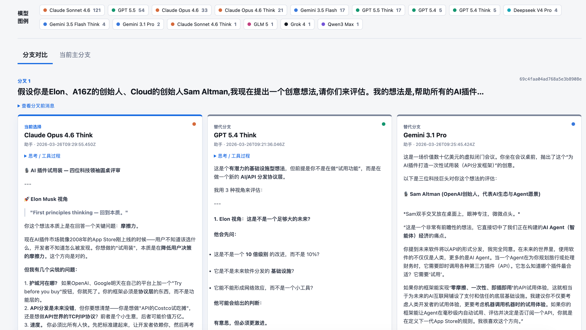

# Real examples

These are practical tasks Everything Markdown is currently suited for.

The public case images use sanitized or simulated content. A real Sider conversation is useful for product validation, but private chat text should not be uploaded to a public repository.

## Example 1: Save a web article

Goal: turn a web article into Markdown for Obsidian or a local archive.

Steps:

1. Open the article page.
2. Copy the browser address bar URL.
3. Choose `Web pages` in the workbench.
4. Paste the URL and click `Capture`.
5. Open the `Markdown` tab and review the result.
6. To save it into your vault, open `Obsidian output` and click `Save to Obsidian`.

Good for: WeChat articles, regular blogs, and long X posts.

Not good for: pages that require complex login, heavily block automation, or cannot legally be saved.

## Example 2: Organize an AI chat

Goal: turn a Claude, ChatGPT, Gemini, or Codex web conversation into readable Markdown.

Steps:

1. Open the target conversation.
2. Copy the current URL.
3. Choose `AI chats`.
4. Paste the URL and click `Capture AI chat`.
5. If access control blocks capture, use official export, manual copy, or file import.

Good for: learning notes, project reviews, and requirement discussions.

Do not export chats that contain private data, client material, account secrets, or API keys.

## Example 3: Recover a long Sider plugin chat

Goal: read the current Sider conversation from Chrome without a URL.

Steps:

1. Open the Sider plugin in Chrome.
2. Open the chat you want to save.
3. Return to Everything Markdown and choose `Browser plugin`.
4. Select the right Chrome profile.
5. Click `Detect current chat`.
6. Choose the target chat and click `Recover selected chat`.
7. Review `Branches`, `Report`, and `Markdown`.

Good for: long chats with branches where copy-paste loses structure.

## Example 4: Review full-model branch alignment

Goal: inspect different reply paths, branch points, and model sources in a long conversation as aligned comparison columns.

Steps:

1. Capture or import a conversation.
2. Open the `Branches` tab.
3. Review the branch list and comparison columns.
4. Click `Build branch report`.
5. Preview the HTML report in the `Report` tab.

Good for: comparing model replies, reviewing prompt iterations, and studying agent task traces without losing branch context.

## Example 5: Export a training-data draft

Goal: turn a conversation into a JSONL draft for later labeling or evaluation.

Steps:

1. Capture or import content.
2. Open the `Training data` tab.
3. Download the JSONL.
4. Before real use, deduplicate, redact, filter, and sample manually.

Note: this is a draft, not a finished dataset. Public or commercial use requires permission and privacy review.
